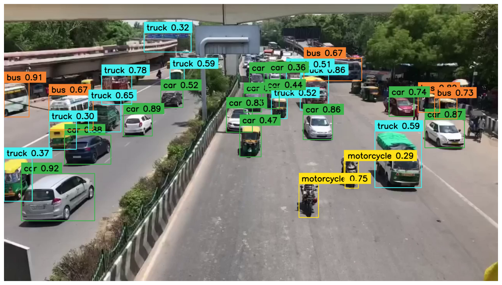
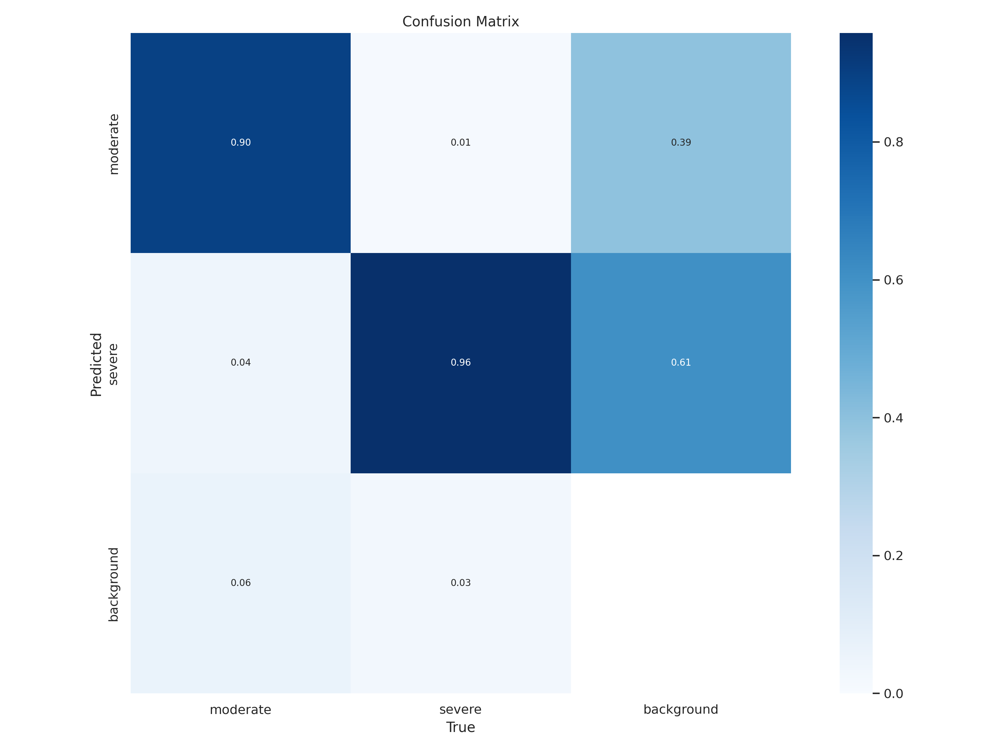
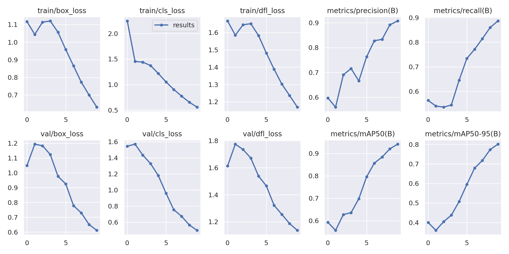

# 🚗 Innovative Vehicle Detection System using Computer Vision (IVDSCV)

  
  
  

An interactive project on **Vehicle Detection** using Machine Learning / Deep Learning techniques.  
This project detects and counts vehicles from video streams or images and provides useful insights through **visualization**.  

---

## 📌 Features
- 🚘 Detect vehicles in images and videos  
- 📊 Count vehicles and generate traffic statistics  
- 🖼️ Real-time bounding box visualization  
- 📉 Data plots for traffic analysis  
- ⚡ Easy to run with Jupyter Notebook  

---

## 🎥 Demo  

### Sample Frame with Bounding Boxes:  





---

## ⚙️ Installation  

Clone the repository and install dependencies:  

```bash
git clone https://github.com/yourusername/vehicle-detection.git
cd vehicle-detection
pip install -r requirements.txt
```

---

## 🚀 Usage  

Run the Jupyter Notebook:  

```bash
jupyter notebook CDTARS.ipynb
```

Or directly run the script (if available):  

```bash
python detect.py --input sample_video.mp4
```

---

## 📊 Results & Visualization  

Vehicle counts over time:  

  

Detection confidence graph:  

  

---

## 📂 Project Structure  

```
📦 Vehicle-Detection
 ┣ 📜 README.md
 ┣ 📜 CDTARS.ipynb
 ┣ 📂 assets
 ┃ ┣ 📜 output1.gif
 ┃ ┣ 📜 output2.png
 ┃ ┣ 📜 output3.png
 ┃ ┗ 📜 output4.png
 ┗ 📜 requirements.txt
```

---

## 🤝 Contributing  

Contributions are welcome! Feel free to fork this repo and submit a pull request.  

---

## 📜 License  

This project is licensed under the **MIT License**.  
